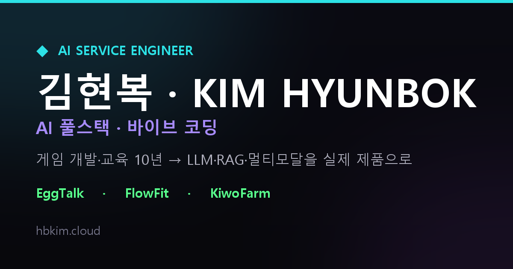

# 김현복 · AI Service Engineer 포트폴리오

<p align="center">
  <a href="https://hbkim.cloud">
    
  </a>
</p>

> 게임 개발·교육 10년 → **LLM·RAG·멀티모달을 실제 제품으로 만드는 AI 풀스택 엔지니어**의 포트폴리오 사이트.
> 홈에서 개발자를 소개하고, 각 프로젝트는 **온사이트 상세 페이지**에서 문제 → 접근 → 아키텍처 → 결과로 풀어냅니다.

🔗 **Live — [hbkim.cloud](https://hbkim.cloud)**

게임 개발자 출신 정체성을 살려 사이트 전체를 **아케이드 게임 톤**으로 연출했고,
방문자가 **"김현복에 대해" 직접 물어볼 수 있는 RAG 챗봇**을 내장했습니다.

---

## 🎮 주요 특징

- **아케이드 리테마** — 네온·CRT 스캔라인·픽셀 HUD로 전체 UI를 게임 화면처럼
- **About = 횡스크롤 슈팅** — 경력(회사·역할·내용)이 우→좌로 흘러와 터렛에 닿으면 격파, 아래 QUEST LOG가 CLEARED로 점등
- **Skills = 로봇 합체** — 기술들이 파츠로 도킹되며 합체(흩어짐 ↔ 재합체 루프)
- **AI 챗봇 (RAG)** — 로컬 임베딩 + OpenAI로 경력·프로젝트·성향을 답하는 "김현봇"
- **프로젝트 상세** — 스크린샷 위에 번호 동그라미로 짚는 **주석 쇼케이스**, 넓은 화면에선 **가로 핀 스크롤**, 시연 영상 임베드, AI 모델 운용 표
- **반응형** — 900px 기준 사이드바 ↔ 모바일 햄버거, `prefers-reduced-motion` 전 구간 대응

---

## 🗂 대표 프로젝트

| 프로젝트 | 한 줄 | 라이브 |
|---|---|---|
| 🥚 **EggTalk** | LLM을 제품 핵심 경험으로 통합한 실시간 AI 다마고치 소셜 플랫폼 (1인 풀스택) | [gamestack.store](https://gamestack.store) |
| 🏢 **FlowFit** | 8개 도메인 25+ AI 기능을 단일 포털로 통합한 사내 AI 워크포스 (팀장) | [flowfit.cloud](https://flowfit.cloud) |
| 🌱 **KiwoFarm** | 공공데이터 RAG + GPT-4o 수확 인증으로 잇는 도시농업 풀사이클 (3인 팀) | [kiwofarm.store](https://kiwofarm.store) |

> 각 상세는 `/projects/:slug` 에서. 콘텐츠는 전부 `src/data/`(단일 소스)에서 관리합니다.

---

## 🛠 기술 스택

- **Frontend** — React 19 · Vite · react-router-dom (멀티페이지 SPA) · **순수 CSS**(디자인 토큰 + 인라인 스타일, Tailwind/TS 미사용)
- **연출** — IntersectionObserver 스크롤 리빌 · `requestAnimationFrame` 슈팅 엔진 · CSS keyframes · sticky 기반 가로 핀 스크롤
- **AI 챗봇** — Vercel 서버리스 함수(`/api/chat`) + OpenAI(`gpt-4o-mini` · `text-embedding-3-small`) · 로컬 사전 임베딩 RAG
- **배포** — Vercel (프론트 + 서버리스 함수) · `vercel.json` SPA 리라이트

---

## 🤖 AI 챗봇 — 로컬 RAG 구조

방문자가 개발자에 대해 물으면, 지식베이스에서 관련 내용을 검색해 답합니다.

- **키 보안** — `OPENAI_API_KEY`는 **서버리스 함수에서만** 사용. 클라이언트 번들엔 키가 전혀 들어가지 않음
- **로컬 사전 임베딩** — 지식 청크를 미리 임베딩해 `api/embeddings.js`로 보관 → 런타임엔 **질문만** 임베딩하고 코사인 유사도로 top-k 검색 (벡터 DB 불필요)
- **남용 가드** — IP당 분당 요청 제한(429) + 질문/히스토리 길이 제한으로 토큰 낭비 방지

```
브라우저 ──POST /api/chat──▶ Vercel 함수 (api/chat.js)
                               ├─ 질문 임베딩 (OpenAI)
                               ├─ api/embeddings.js 와 코사인 top-k
                               └─ 컨텍스트 + 페르소나 → gpt-4o-mini → 답변
```

지식 수정 시: `docs/chatbot_knowledge.md` + `api/knowledge.js` 갱신 → `npm run embed` 로 임베딩 재생성.

---

## 📁 구조

```
api/                  Vercel 서버리스 함수 (RAG 챗봇)
  chat.js             질문 임베딩 → 검색 → 답변 (+ rate limit)
  knowledge.js        지식 청크 소스
  embeddings.js       사전 계산 임베딩 (npm run embed 로 생성)
src/
  main.jsx            BrowserRouter 루트
  App.jsx             Routes — "/" Home, "/projects/:slug" 상세
  data/               projects.js · profile.js  (콘텐츠 단일 소스)
  pages/              Home · ProjectDetail
  sections/           Hero · About · Skills · Projects · Contact
  components/         Sidebar · Chatbot · CareerQuest · SectionNext …
  hooks/              스크롤·애니메이션 훅
scripts/embed.mjs     지식 임베딩 생성 스크립트
public/               정적 자산 (이미지·아이콘·영상·OG)
```

---

## ⚙️ 로컬 실행

```bash
npm install
npm run dev        # 개발 서버 (챗봇은 .env 의 OPENAI_API_KEY 사용)
npm run build      # 프로덕션 빌드 → dist/
npm run preview    # 빌드 미리보기
npm run lint       # ESLint
npm run embed      # 챗봇 임베딩 재생성 (지식 변경 후)
```

**챗봇을 로컬에서 쓰려면** 루트에 `.env` 생성:

```bash
cp .env.example .env
# .env 에 OPENAI_API_KEY=sk-... 입력
```

`npm run dev`가 Vite 미들웨어로 `/api/chat` 함수를 그대로 실행합니다.

---

## 🚀 배포 (Vercel)

1. 저장소를 Vercel에 연결 (프레임워크 자동 인식 — Vite)
2. **Settings → Environment Variables 에 `OPENAI_API_KEY` 추가** (이게 있어야 챗봇이 라이브에서 동작)
3. `api/` 함수와 `vercel.json` SPA 리라이트는 자동 처리

> 보안: `.env`는 커밋되지 않음(`.gitignore`). `api/embeddings.js`는 벡터 숫자뿐이라 커밋해도 무방하며, 그래야 빌드 없이 배포됩니다.

---

## 📮 Contact

- **Email** — asd25999@gmail.com
- **GitHub** — [github.com/asd2599](https://github.com/asd2599)
- **Site** — [hbkim.cloud](https://hbkim.cloud)
